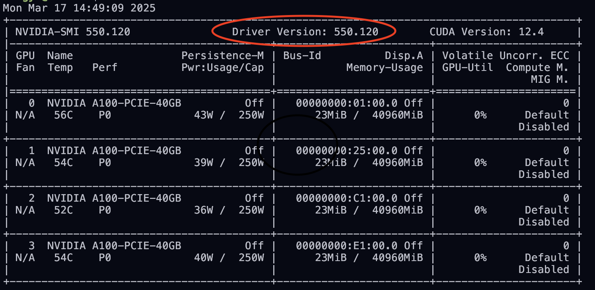
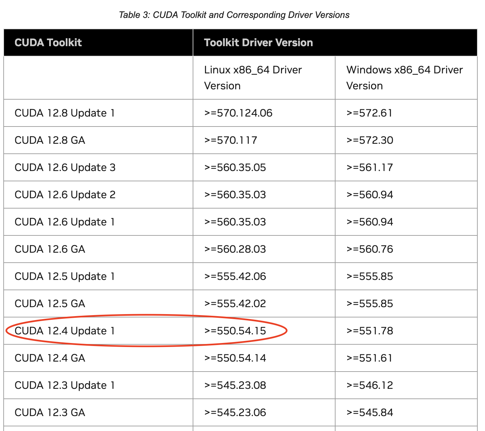
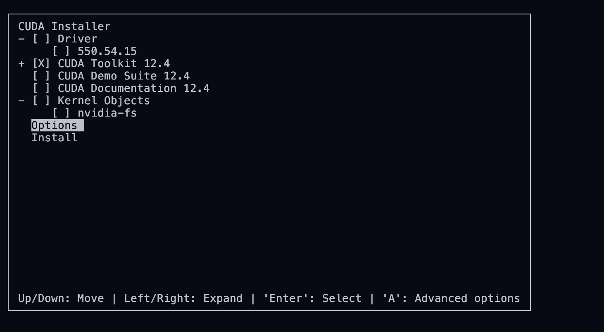
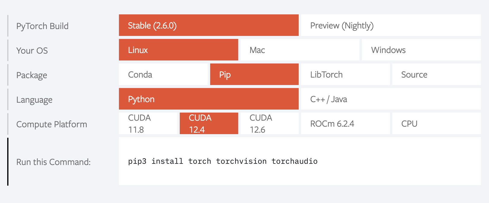

# 环境配置

## 1. SSH

### 1.1 服务器端 (root)

**检查ssh服务状态**

```bash
systemctl status ssh
```

如果SSH服务正在运行，则输出：

> Active:active(running)since...

如果SSH服务没有安装或未运行，会输出：

> Unit ssh.service could not be found.


检查ssh服务是否安装

```bash
which sshd
```

如果已安装则输出下面内容，否则需要安装ssh服务

> /usr/sbin/sshd


**安装ssh服务并设置开机自启动**

```bash
sudo apt install openssh-server	# 安装ssh服务
sudo systemclt start ssh	# 启动ssh服务
sudo systemclt enable ssh	# 设置ssh服务开机自启动
systemclt status ssh	# 验证ssh服务状态
netstat -tpln	# 查看ssh服务端口
```


**配置ssh服务**

修改ssh服务配置文件

```bash
sudo vim /etc/ssh/sshd_config
```

修改以下内容，保存并退出 `:wq`

```
PermitRootLogin yes	# 设置root用户可以远程ssh登陆
ClientAliveInterval 60	# 设置心跳间隔，服务器每60秒向客户端发送一个空消息
ClientAliveCountMax 0	# 设置断联心跳次数，设置为0表示服务器不会因为客户端无响应而自动断开连接
TCPKeepAlive yes	# 设置定期发送小的数据包来检测一个连接是否仍然活跃
```

重启ssh服务

```bash
sudo systemclt restart ssh	# 重启ssh服务
```


### 1.2 客户端

**标准ssh连接**

密码ssh连接命令，其中 `post` 为本地端口，`host_post` 为服务器端口，`username` 为服务器用户名，`server_ip` 为服务器ip地址，`ssh_port` 为服务器SSH端口

```bash
ssh -L post:localhost:host_port username@server_ip -p ssh_port
ssh username@server_ip -p ssh_port	# 简化版
```

私钥ssh连接命令，其中 `~/.ssh/id_rsa` 为私钥路径（私钥可以自己生成或来自管理员）

```bash
ssh -i ~/.ssh/id_rsa_xxx post:localhost:host_port username@server_ip -p ssh_port
ssh -i ~/.ssh/id_rsa_xxx username@server_ip -p ssh_port	# 简化版
```

但是，每次连接服务器都需要输入密码和繁琐的SSH连接命令，为了方便和安全，可以在本地配置ssh密钥登录和别名登陆


**使用自己生成的密钥连接**

在本地生成SSH密钥对，如果已经有密钥对可以跳过这一步

```bash
ssh-keygen -t rsa -C "email@xxx.com"
```

在终端输入上述命令，会在 `~/.ssh/` 目录（windows应该是 `C:\Users\用户\.ssh`）下生成私钥 `id_rsa`和 公钥 `id_rsa.pub`。然后将公钥 `id_rsa.pub` 的内容复制到服务器的 `~/.ssh/authorized_keys` 文件中，应该是 `ssh-rsa` 开头，`email@xxx.com` 结尾，如果没有该 `authorized_keys` 文件则在用户根目录新建

然后就可以使用 `ssh -i ...` 连接服务器了


**使用管理员发送的密钥连接**
在本地的`~/.ssh/id_rsa_xxx`中写入服务器管理员给的私钥，然后进行适当的权限设置，通常是`600`或`400`，以确保只有自己可读取

```bash
chmod 600 ~/.ssh/id_rsa_xxx
```

然后就可以使用 `ssh -i ...` 连接服务器了


**最方便，别名登陆**

在本地 `~/.ssh/config` 文件中添加如下内容，如果没有该 `config` 文件则新建：

```
Host server_alias
    HostName server_ip
    LocalForward post localhost:host_port # 可以省略这一行
    Port ssh_port
    User username
    IdentityFile ~/.ssh/id_rsa_xxx	# 默认是`~/.ssh/id_rsa`，非指定可以省略这一行
```

其中 `server_alias` 为服务器别名，`IdentityFile` 配置本地私钥路径，用于配置连接多个服务器

配置完成后，可以直接在终端输入下面内容就可以连接服务器

```bash
ssh server_alias
```


## 2. CUDA Toolkit (not root)

**检查是否安装CUDA Toolkit**

```bash
nvcc -V
```

如果输出如下，则需要安装CUDA Toolkit

> Command 'nvcc' not found, but can be installed with:
> apt install nvidia-cuda-toolkit
> Please ask your administrator.


**安装CUDA Toolkit**

一定安装与显卡驱动兼容的CUDA Toolkit版本

首先，检查显卡驱动版本

```bash
nvidia-smi
```



在 [NVIDIA CUDA Toolkit Release Notes](https://docs.nvidia.com/cuda/cuda-toolkit-release-notes/index.html) 中查找与显卡驱动版本 `Driver Version: 550.120` 兼容的CUDA Toolkit版本



继续查看系统版本

```bash
lsb_release -a
```

> No LSB modules are available.
> Distributor ID:	Ubuntu
> Description:            Ubuntu 22.04.4 LTS
> Release:	           22.04
> Codename:	     jammy

就可以到 [CUDA Toolkit Archive](https://developer.nvidia.com/cuda-toolkit-archive) 下载相应版本的CUDA Toolkit了

```bash
cd ~
wget https://developer.download.nvidia.com/compute/cuda/12.4.1/local_installers/cuda_12.4.1_550.54.15_linux.run
```

运行安装程序

```bash
sh cuda_12.4.1_550.54.15_linux.run
```

进入安装界面后选择 `continue` 然后输入 `accept`，在下图页面中只选择安装 `CUDA Toolkit 12.4`

注意，先不要 `Install`，进入 `option` 选择 `Toolkit Options` 下的 `Change Toolkit Install Path`，将原来的 `usr/local/cuda-12.4/` 改为用户根目录下的路径 `/home/wangyf/cuda-12.4/`



修改路径完成后，`Done` 回上图页面，选择 `Install` 进行安装，安装结束后可能会提示未安装 `CUDA Driver` 不用管

接下来修改环境变量

```bash
vim ~/.bashrc
```

添加如下内容，保存并退出 `:wq`

```bash
# CUDA Toolkit
export PATH="/home/wangyf/cuda-12.4/bin:$PATH"
export LD_LIBRARY_PATH="/home/wangyf/cuda-12.4/lib64:$LD_LIBRARY_PATH"
```

刷新环境变量

```bash
source ~/.bashrc
```


**验证是否安装成功**

```bash
nvcc -V
```

> nvcc: NVIDIA (R) Cuda compiler driver
> Copyright (c) 2005-2024 NVIDIA Corporation
> Built on Thu_Mar_28_02:18:24_PDT_2024
> Cuda compilation tools, release 12.4, V12.4.131
> Build cuda_12.4.r12.4/compiler.34097967_0

如果输出上述内容，则说明安装成功


## 3. Miniconda

**安装Miniconda**

使用清华镜像下载Miniconda

```bash
cd ~
wget -c https://mirrors.tuna.tsinghua.edu.cn/anaconda/miniconda/Miniconda3-latest-Linux-x86_64.sh
```

运行安装程序

```bash
sh Miniconda3-latest-Linux-x86_64.sh
```

一直回车或输入`yes`，如果安装成功则显示

> Thank you for installing Miniconda3!


断开ssh连接，重新连接才会显示在conda的base环境下

> (base) wangyf@4A100:~$


**配置国内源和基本开发环境**

为conda配置清华源

```bash
conda config --add channels https://mirrors.tuna.tsinghua.edu.cn/anaconda/pkgs/main
conda config --add channels https://mirrors.tuna.tsinghua.edu.cn/anaconda/pkgs/free
conda config --add channels https://mirrors.tuna.tsinghua.edu.cn/anaconda/pkgs/r
conda config --add channels https://mirrors.tuna.tsinghua.edu.cn/anaconda/pkgs/pro
conda config --add channels https://mirrors.tuna.tsinghua.edu.cn/anaconda/pkgs/msys2
```


为pip配置清华源

```bash
cd ~
mkdir .pip
vim .pip/pip.conf
```

在最下方添加下面内容，保存并退出 `:wq`

```
[global]
index-url = https://pypi.tuna.tsinghua.edu.cn/simple
[install]
trusted-host = https://pypi.tuna.tsinghua.edu.cn
```

检查是否配置成功

```bash
pip config list
```

>global.index-url='https://pypi.tuna.tsinghua.edu.cn/simple'
>install.trusted-host='https://pypi.tuna.tsinghua.edu.cn'


创建开发环境并进入环境（最好使用python3.8，更高版本有些工具可能不兼容）

```bash
conda create -n py38 python=3.8 -y
conda activate project
```

然后就会看到终端中的 `(base)` 变成了 `(py38)`，这表示进入了新建的 `py38` 环境，如需删除环境，则

```bash
conda remove -n py38 --all -y
```


**配置Pytorch**

从 [Pytorch](https://pytorch.org/) 获取下载命令，conda环境中建议使用 `python -m pip install ...` 而不是 `pip install ...`



按需下载安装，保证已经使用 `conda activate` 进到环境中，命令行也会显示是从清华源下载的

```bash
python -m pip install torch
```

> Looking in indexes: https://pypi.tuna.tsinghua.edu.cn/simple
> Collecting torch
> Downloading ...

检查是否安装 `gpu` 版本 `torch`，运行python脚本

```python
import torch
torch.__version__	# 如正常则返回版本号 "2.4.1+cu121"
torch.cuda.is_available()	# 如正常则返回 "True"
a = torch.Tensor([1.])
a.cuda()	# 如正常则返回"tensor([ 1.], device='cuda:0')"
torch.backends.cudnn.is_acceptable(a.cuda())	# 如正常则返回 "True"
```


如要批量安装python库，可以使用

```bash
python -m pip install transformers accelerate peft datasets evaluate swanlab argparse loguru numpy jsonlines modelscope
```

或者创建`requirements.txt`，新建内容

```
transformers==x.x.x
accelerate==x.x.x
peft==x.x.x
datasets==x.x.x
evaluate==x.x.x
swanlab
argparse
loguru
numpy
jsonlines
modelscope
```

然后

```bash
python -m pip install -r requirements.txt
```


## 4. .bashrc/.vimrc/.tmux.conf

**.bashrc**

```bash
export TERM="xterm-256color"

alias watchnv="watch -n 0.1 nvidia-smi"
alias cda="conda activate"
alias accl="accelerate launch"
alias cdr="cda rp38; cd ~/Repos/; clear"
alias cdm="cda rp38; cd ~/Models/; clear"
alias cdd="cda rp38; cd ~/Datasets/; clear"
alias ta="tmux a"
alias tat="tmux a -t"
alias tns="tmux new -s"
alias tls="tmux ls"
```


**.tmux.conf**

```
# 添加第二个前缀键，不影响原前缀键
set-option -g prefix2 C-Space

# 序号从1开始
set -g base-index 1
set -g pane-base-index 1
set -g renumber-windows on
# 颜色文件
set -g default-terminal 'tmux-256color'

# Visual mode
set -g mouse on
```

